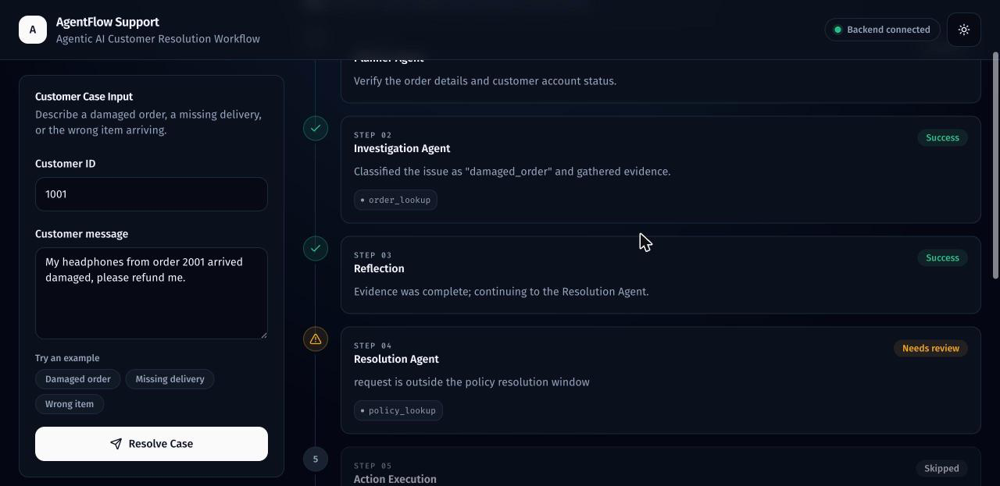
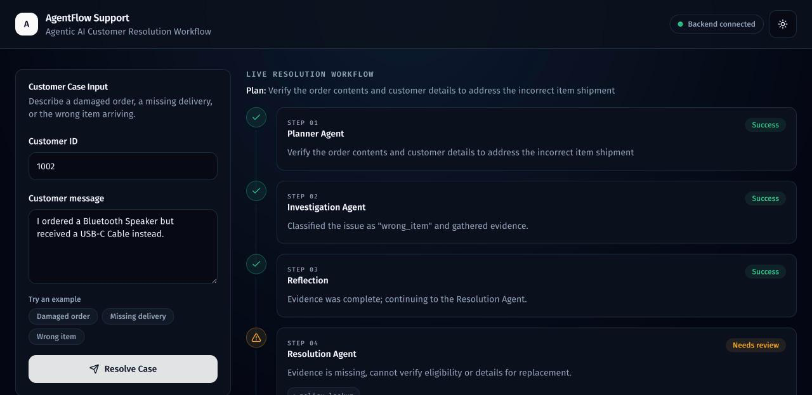
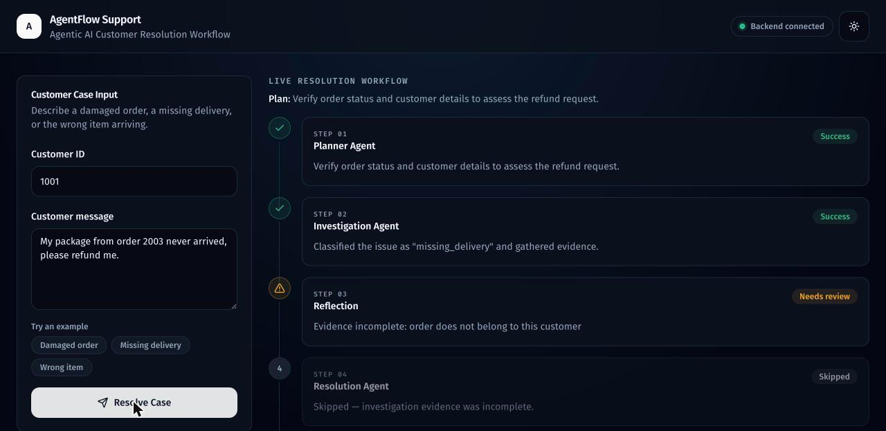
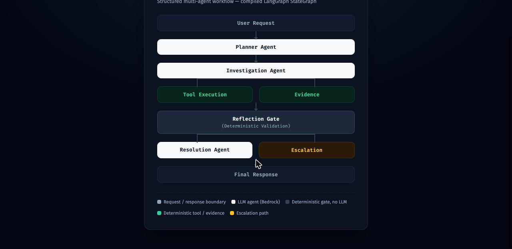
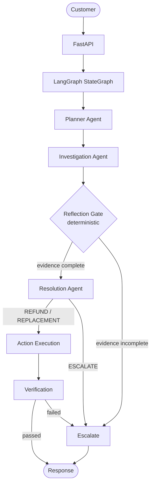

# Multi-Agent Task Resolution

A multi-agent AI customer resolution system built with LangGraph, Amazon Bedrock Mantle, FastAPI, and PostgreSQL.

## Demo



Multi-Agent Task Resolution uses LangGraph to orchestrate a Planner Agent, an Investigation Agent, a deterministic Reflection Gate, and a Resolution Agent — with deterministic tools, policy validation, action execution, and verification enforcing every business rule.

| Wrong item delivered | Escalation case |
|---|---|
|  |  |

## 1. Problem Statement

Customer support teams spend a large share of their time on a small set of repetitive, well-defined issues — a damaged order, a delivery that never arrived, the wrong item showing up. Each of these follows a predictable pattern: understand what happened, check what the order and policy actually allow, and either resolve it or hand it to a human. Handling these manually doesn't scale, but resolving them with a single opaque LLM call is risky — a support agent can't be allowed to hallucinate a refund a policy doesn't permit.

Multi-Agent Task Resolution automates exactly these three issue types end to end, using LLM agents for understanding and reasoning, while every action that touches the database or a policy boundary is enforced by deterministic Python — not the model.

## 2. Why Multi-Agent Task Resolution?

Most LLM-powered support tools work the same way: send the customer's message to a model, and let that model generate whatever answer or action it thinks is appropriate. That's fast to build, but it puts something a support system can't afford — refunds, replacements, escalations — behind a single non-deterministic text generation. The model can misread a policy, invent a detail, or simply be inconsistent between two nearly identical requests.

Multi-Agent Task Resolution is built on a different assumption: an LLM is good at understanding unstructured text and proposing a next step; Python is good at enforcing rules consistently. So the work is split accordingly, across a structured multi-agent workflow instead of one large prompt:

- **Planner Agent** — reads the customer's message and produces a short investigation approach before any data is touched.
- **Investigation Agent** — decides which lookup tools are actually needed and gathers evidence (customer, order) using them.
- **Reflection Gate** — a deterministic, non-LLM checkpoint that verifies the gathered evidence is genuinely complete before the case is allowed to proceed further.
- **Resolution Agent** — reasons over the evidence and the applicable policy to generate one final action: refund, replacement, or escalation.

The design philosophy that runs through all of it:

> **LLM proposes → Python validates → Action executes.**

No agent in this system can directly cause a refund, a replacement, or a database write. Every proposal an agent makes — a plan, a classification, a decision — passes through deterministic Python before it can have any effect, and a proposal that fails validation is escalated to a human rather than forced through. This doesn't make the system smarter than a single well-prompted LLM call; it makes its failure mode safer — the worst case is an unnecessary escalation, not an incorrect refund.

## 3. Architecture





The graph is a real, compiled LangGraph `StateGraph` — `POST /api/cases/resolve` calls `await compiled_graph.ainvoke(...)`, not a hand-rolled orchestration loop. Routing between nodes (e.g. proceed to action execution vs. escalate) is plain Python reading structured state, never an LLM decision. There are no back-edges anywhere in the graph — it's a strict DAG, so there's no infinite-loop risk by construction.

## 4. Agent Design

The system has **3 LLM agents** and **1 deterministic gate**:

**Planner Agent**
- Produces a short investigation plan (`goal`, `required_steps`, `required_tools`) from the customer's message
- Does not investigate anything itself and does not decide on a resolution
- Runs first, before any tool is called

**Investigation Agent**
- Reads the customer's message and classifies it into one of the three supported issue types (or flags it as unclear)
- Decides *which* of the two read-only lookup tools it actually needs (`customer_lookup`, `order_lookup`) — the LLM proposes tool names, Python validates them against an allowlist before anything runs
- Gathers evidence from those tool calls and reports what's still missing, so downstream steps never proceed on incomplete information

**Reflection Gate** *(deterministic Python, not an LLM call)*
- Checks whether the Investigation Agent's evidence is actually complete before letting the case proceed
- If evidence is missing, routes straight to escalation — the Resolution Agent is never even invoked

**Resolution Agent**
- Reasons over the gathered evidence and the applicable policy to propose one decision: `REFUND`, `REPLACEMENT`, or `ESCALATE`
- Never executes anything itself — it returns a proposal with a reason
- Escalates whenever the investigation is incomplete, no policy exists for the issue, or the resolution window has passed — before ever calling the LLM for a decision

## 5. Tool Layer

Five deterministic, plain-Python tools — no LLM logic inside any of them:

| Tool | Purpose |
|---|---|
| `customer_lookup` | Look up a customer by ID or email |
| `order_lookup` | Look up an order by ID, optionally verifying it belongs to the given customer |
| `policy_lookup` | Look up the refund/replacement policy for an issue type |
| `resolution_action` | Apply a validated `REFUND`/`REPLACEMENT`, only after re-checking the policy allows it and the case isn't already closed |
| `escalate_case` | Mark a case for human review with a reason, blocked if the case is already resolved or escalated |

Every tool returns the same small, JSON-serializable shape: `{"success": bool, "data": ..., "error": ...}`.

## 6. Safety Design

- **The LLM never directly executes an action.** It proposes a classification or a decision; a tool call only happens after deterministic Python decides to make it.
- **Python validates business rules**, not the model — e.g. a proposed `REFUND` is checked against `policy.refund_allowed` and the resolution window before any database write.
- **Policy constraints are enforced deterministically** at two independent points: once by the Resolution Agent before proposing, and again by `resolution_action` itself at execution time.
- **Verification happens before the final response** — a dedicated `verify_action` node checks the action actually succeeded, the recorded resolution matches what was proposed, and a reference was generated, before the graph is allowed to respond successfully.
- **Bedrock calls are bounded and fail safely.** Every LLM call has a request timeout, and if the LLM or network fails mid-case, the case is escalated with a clear "system failure" reason rather than left stuck in an unresolved state.
- **Every workflow event is logged** (case ID, agent, node, decision) for after-the-fact auditing of exactly what each case did and why.

## 7. Evaluation Results

A 33-scenario evaluation suite (`evaluation/`) runs the complete system end to end — real Bedrock calls, real agents, real graph — against a reproducible fixture database.

| Metric | Result |
|---|---|
| Scenarios | 33 |
| Issue classification accuracy | 100% |
| Resolution accuracy | 93.94% |
| Final status accuracy | 96.97% |
| Escalation accuracy | 96.97% |
| Average latency | 2.29s |

See `evaluation/README.md` for scenario breakdown and `evaluation/results.json` for the full per-scenario detail, including the handful of genuine model disagreements behind the resolution-accuracy figure.

## 8. Tech Stack

**Backend**
- Python, FastAPI, LangGraph, Amazon Bedrock Mantle (OpenAI-compatible client)
- PostgreSQL, SQLAlchemy
- pytest

**Frontend**
- Next.js (App Router), TypeScript, Tailwind CSS
- shadcn/ui component system
- TanStack Query (server state), Zustand (client/session state)
- React Hook Form + Zod (form validation)
- Framer Motion (transitions), next-themes (dark/light mode)

**Infrastructure**
- Docker + Docker Compose (backend + PostgreSQL)

## 9. Example Workflow

**Customer message:** "My headphones from order 2001 arrived damaged, please refund me."

```
✓ Planner Agent          Verify the order details and customer account status
✓ Investigation Agent    Classified the issue as "damaged_order" and gathered evidence
✓ Reflection Gate        Evidence was complete; continuing to the Resolution Agent
✓ Resolution Agent       Proposed a refund, validated against policy
✓ Action Execution       Executed the refund and recorded an action reference
✓ Verification           Confirmed the action succeeded before responding
```

**Final result:** `Resolution: REFUND · Reference: ACT-3F2A9C1B4D`

## 10. Project Structure

```
Multi-Agent-Task-Resolution/
├── backend/
│   ├── app/
│   │   ├── main.py              # FastAPI app, CORS, startup, /health
│   │   ├── config.py            # settings (pydantic-settings)
│   │   ├── db.py                # SQLAlchemy engine/session
│   │   ├── models.py            # Customer, Order, Policy, Case
│   │   ├── bedrock_client.py    # Bedrock Mantle client (with timeout)
│   │   ├── logging_config.py    # structured logging setup
│   │   ├── graph/
│   │   │   ├── state.py         # CaseState
│   │   │   ├── tools.py         # 5 deterministic tools
│   │   │   ├── agents.py        # Planner, Investigation, Resolution agents
│   │   │   └── graph.py         # compiled LangGraph StateGraph
│   │   └── routes/
│   │       ├── cases.py             # POST /resolve, GET /{case_id}
│   │       └── workflow_summary.py  # builds the API's step/tools summary
│   ├── tests/
│   ├── Dockerfile
│   └── requirements.txt
├── frontend/
│   ├── app/                     # Next.js page, layout, providers
│   ├── components/
│   │   ├── agents/               # workflow trace UI (AgentStepCard, WorkflowPanel)
│   │   ├── dashboard/             # case input, resolution summary, metrics, status
│   │   └── ui/                   # shadcn/ui primitives
│   ├── hooks/                    # useResolveCase, useBackendStatus
│   └── lib/                      # api.ts, store.ts (Zustand), workflow.ts, schema.ts
├── evaluation/                    # 33-scenario evaluation harness
├── seed/                          # sample customers/orders/policies
├── docs/                          # README screenshots
├── docker-compose.yml
└── README.md
```

## 11. Setup & Running

### Prerequisites
- Python 3.13+, Node.js 20+, PostgreSQL 16 (or Docker)
- An Amazon Bedrock Mantle-compatible endpoint, API key, and model name

### Backend

```bash
cd backend
python3 -m venv .venv && source .venv/bin/activate
pip install -r requirements.txt

cp .env.example .env
# then edit .env: DATABASE_URL, AWS_REGION, BEDROCK_BASE_URL, BEDROCK_API_KEY, BEDROCK_MODEL

createdb agentflow_support   # if not using Docker for Postgres
psql -d agentflow_support -f ../seed/seed_data.sql   # optional sample data

uvicorn app.main:app --reload
```
Tables are created automatically on startup (idempotent). Backend runs at `http://localhost:8000`.

### Frontend

```bash
cd frontend
npm install
cp .env.example .env.local   # NEXT_PUBLIC_API_URL=http://localhost:8000
npm run dev
```
Runs at `http://localhost:3000`.

### Docker (backend + PostgreSQL)

```bash
cp backend/.env.example backend/.env   # fill in real Bedrock values
docker compose up
```
This starts PostgreSQL and the backend together; `DATABASE_URL` is wired automatically to the compose Postgres service. No secrets are hardcoded in `docker-compose.yml` — it reads `backend/.env` at run time.

### Tests

```bash
cd backend
python -m pytest tests/ ../evaluation/test_run_evaluation.py
```

## 12. Future Improvements

- Conversation memory across multiple messages in the same case
- More business policies and issue types beyond the current three
- A human-approval step before executing higher-risk resolutions
- Production-grade authentication, authorization, and rate limiting
- Per-node retry policies for transient Bedrock/network failures
- Row-level locking on `resolution_action`/`escalate_case` to close a theoretical concurrent-request race

## License

MIT — see [LICENSE](LICENSE).
